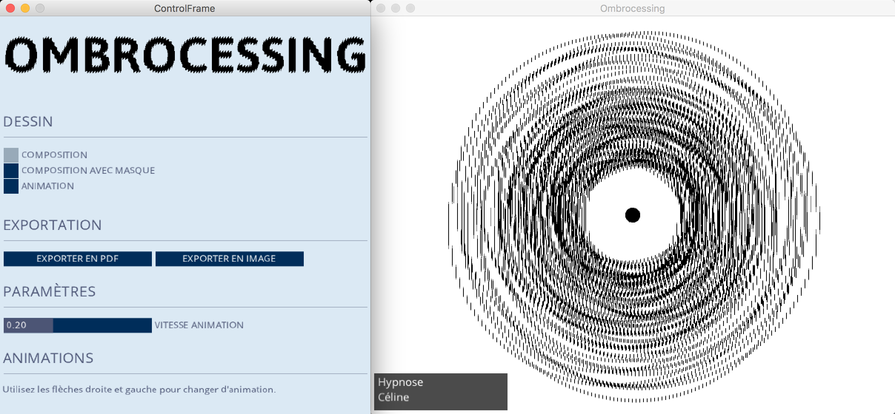
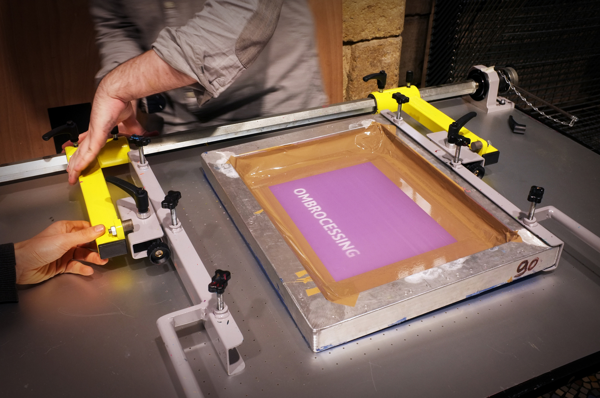

Ombrocessing is a workshop led by myself and [Émeline Vivier](https://www.atelierserrejoint.com/) using [Processing](http://www.processing.org), ombrocinema technique and serigraphy to produce a set of printed frame-by-frame animations booklet.

[www.ombrocessing.org](http://www.ombrocessing.org)

### Video
https://vimeo.com/267686259

### Images
##### Booklets

##### Interface

It was developed with Processing 3.3.1 (MacOS 10.12.5) with the following librairies : 
* [Controlp5](http://www.sojamo.de/libraries/controlP5/) by Andreas Schelgel for handling gui controls.
* [Geomerative](http://www.ricardmarxer.com/geomerative/) by Ricard Marxer for handling TTF font loading.
* [GifAnimation](https://github.com/01010101/GifAnimation) 3.x version by Jérôme Saint-Clair based on original code by Patrick Meister. 

#### During workshop

